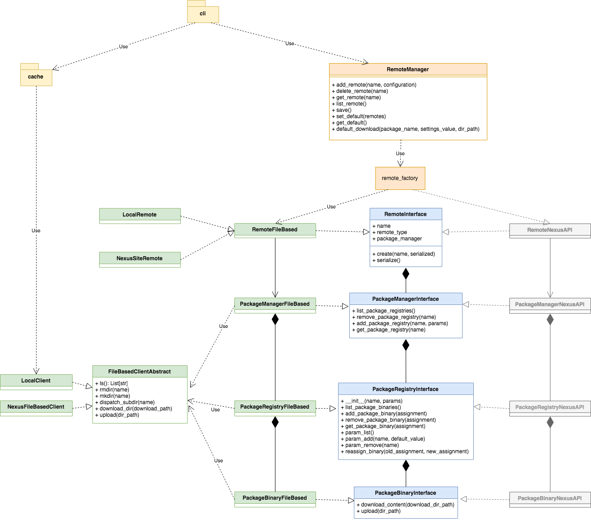

**************
Design Diagram
**************

Class Diagram
=============
There is some known violation of best practices in the design. The most prominent one is probably the violation of
Liskov Substitution Principle. As quoted from Wikipedia:
    Substitutability is a principle in object-oriented programming stating that, in a computer program, if S is a
    subtype of T, then objects of type T may be replaced with objects of type S (i.e. an object of type T may be
    substituted with any object of a subtype S) without altering any of the desirable properties of the program
    (correctness, task performed, etc.).
For the current implementation, the PackageManagerFileBased directly depends on FileBasedClientAbstract. Thus we can't
use it to replace the abstract PackageManager to use any client. And it also uses directly the PackageRegistryFileBased
rather than a generic PackageRegistry. Decoupling PackageRegistryFileBased from PackageRegistryFileBased seems to be
more likelihood but it may be very difficult to have an implementation of PackageRegistry that is independent of the
Client implementation.

