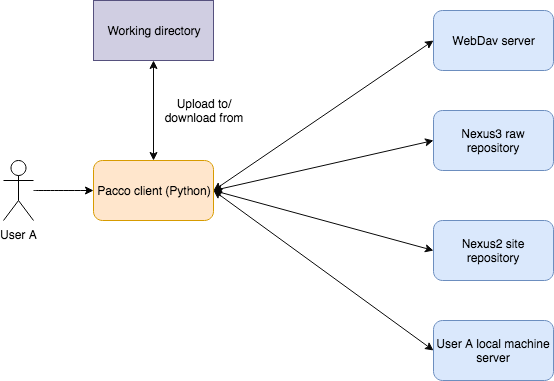

*******************
Pacco Documentation
*******************

.. image:: _images/pacco.png

.. toctree::
   :maxdepth: 2

   api_docs/index
   diagram
   tutorial/index

What is Pacco?
==============
Pacco is a simple tool to store binary files (and directories) to various file storage systems. With Pacco, you can
have a language-independent dependency management that helps you to store and download dependencies for your project.
An important note here is that pacco does not help to manage the dependency of your project directly (as in pip for
windows, conan for c++ and gradle/maven for java projects.) What it does is just to manage some binaries (or source
files, [though it's meant to be used for prebuilt binaries, Pacco accept just any file]), in a structured
manner in a remote server.

Remote, registry and binary
***************************
There are three main "objects" in Pacco. "Remote", "registry" and "binary". Pacco's remote represent a remote file
server where you will store the binary. Registry helps to group the binary. For example, you can have a registry
named "openssl" to store all binaries of various versions and build configuration for openssl. Binary within a
registry is distinguished based on the configuration. In the example of openssl, we can have two different binaries:
one is v1.0 built for osx, the other one is v2.0 built for ubuntu-16.04. In short, a remote will have multiple
registries, and a registry will have multiple binaries.

.. figure:: _images/remote_registry_binary.png
    :alt: An example of the relation between remote, registry and binary.
    :figclass: align-center

    An example of the relation between remote, registry and binary.

Centralized
***********
Pacco is centralized. Your local machine is not an equivalent of a server but rather just acting as a client to the
remote server. This design decision is made for the sake of simplicity and also considering the fact that use case is
mostly reading/fetching/downloading and rarely writing/pushing/uploading.

However, you (as a client) can connect to
multiple remote server at the same time, and even you can have a simple server at your local machine (the files is
located at the directory ``~/.pacco/``. Actually, if we can have a server at the local machine, having the sync
functionality to another remote server will be something like "clone" as in "git clone". This will make Pacco closer
to decentralized. But certainly it's still a lot of things to do and will be only added if necessary.

    An illustration showing Pacco as a centralized system.

Built with pure Python
**********************
Pacco is entirely built with Python (>=3.7) for portability (any machine shall be able to use it as long as it has
Python installed) and re-usability (a lot of it's internal API can be easily integrated to other Python app/script
without having to access the CLI).

Getting help
============
The easiest way to know more and ask questions regarding Pacco is through the `Github issue <https://github
.com/kwinata/pacco/issues>`_.

Other resources
===============
